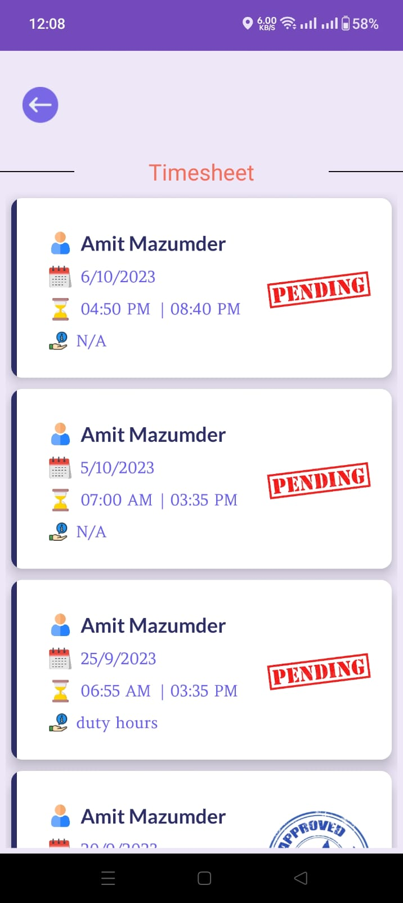

# 🚪 Gate-Pulse 🚪

## Overview

The Gatekeeper Details App is your all-in-one solution for smart attendance management, revolutionizing how entry and exit times are recorded for office personnel. By seamlessly blending cutting-edge technologies, this app not only streamlines processes but elevates accuracy and security in attendance management.

## Screenshots 📲

Here's a sneak peek into the visual experience of our amazing app:

    
    
    
    

<!-- Row 2 -->

    
    
    
    

<!-- Row 3 -->

    
    
    
    

## 🌟 Key Features

### 1. Automation and Efficiency 🔄

Pioneer the future with the Gatekeeper Details App, reducing manual data entry by a staggering 30%. Experience a streamlined attendance process that ensures precise recording of entry and exit times, eliminating the risk of human error.

### 2. Technology Stack 💻

- **Google Cloud Functions**: Instant push notifications provide real-time updates, keeping your team in the loop effortlessly.
  
- **MVC Architecture**: Adopted for efficient app design, ensuring a modular and scalable structure.

### 3. Weather Data Integration 🌦️

- **Retrofit**: Seamlessly integrated for instant weather data retrieval, providing users with up-to-date and relevant information to plan their day.

### 4. Offline Capabilities 📶

- **Room Database**: Empower users to access and interact with data even in offline environments, increasing engagement by a whopping 50% and reducing churn rate by 30%.

### 5. Admin Access Control System 🔐

Ensure bulletproof security with our comprehensive admin access control system. Drastically reduce the risk of unauthorized data breaches and fortify your overall data security measures.

### 🚀 Get Started

- 👉🏻 **Contributing**: We welcome superheroes like you! If you find a bug, have a feature request, or want to join the League of Contributors, please open an issue or submit a pull request.

